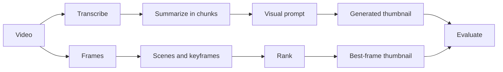
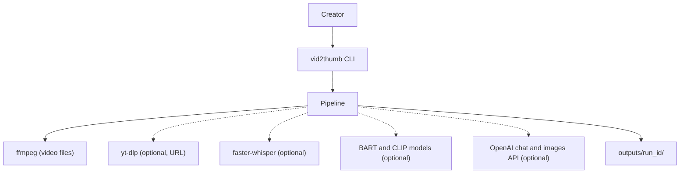
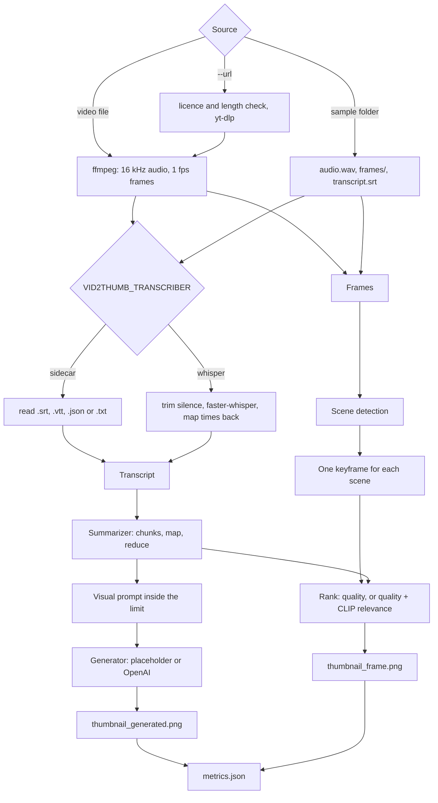

<div align="center">

# vid2thumb — Video to Transcript, Summary and Thumbnail

**vid2thumb is a thumbnail pipeline for spoken videos. It takes a video through these steps to two thumbnails, a generated image and the best real frame:**

`transcribe` → `summarize in chunks` → `write a visual prompt` → `generate` · `detect scenes` → `rank frames` → `evaluate`.


**[Summary](#1-summary)** ·
**[Workflow](#4-the-end-to-end-workflow)** ·
**[Run it](#14-how-to-run-vid2thumb)** ·
**[Configuration](#144-environment-variables)** ·
**[Known problems](#17-known-problems)** ·
**[Glossary](#19-glossary)**

</div>

> [!NOTE]
> This README uses ASD-STE100 Simplified Technical English. The writing rules and the project
> vocabulary are in [`docs/ste-style-guide.md`](docs/ste-style-guide.md). Each term in the
> [Glossary](#19-glossary) has only one meaning.

> [!WARNING]
> Use only videos that you own or that have a licence that allows reuse. A download of other videos can break the terms of the platform.
> Keep your API key in the environment or in a local `.env` file. Never write a key in code or in a notebook.

---

vid2thumb makes a thumbnail for a spoken video in two ways.
The text branch transcribes the speech, summarizes the full transcript in chunks and writes a short visual prompt for an image generator.
The frame branch detects the scenes of the video and ranks the real frames by quality, and optionally by CLIP relevance to the summary.
Each run saves all outputs, the settings and the metrics in one run folder.
All components have an offline implementation, so the demo and the tests run with no key and no network.

This README is the **one location that explains all of vid2thumb**. It gives these topics:

- the general design
- each component and its procedure, step by step
- the decision rules
- the data map
- the runbook
- the validation results and the known problems

| If you are… | Read |
|---|---|
| A manager or reviewer | [1](#1-summary), [3](#3-design-rules), [4](#4-the-end-to-end-workflow), [16](#16-validation-results), [18](#18-key-points) |
| A developer who joins the project | All sections, in sequence. Keep [14](#14-how-to-run-vid2thumb) and [17](#17-known-problems) open while you work |
| An operator who runs vid2thumb | [14](#14-how-to-run-vid2thumb), then the section for the component that you use |

---

## Table of contents

1. 🧭 [Summary](#1-summary)
2. 🏗️ [How vid2thumb is built](#2-how-vid2thumb-is-built)
   - 2.1 [Components](#21-components)
   - 2.2 [System context](#22-system-context)
   - 2.3 [Repository layout](#23-repository-layout)
3. 🛡️ [Design rules](#3-design-rules)
4. 🔄 [The end-to-end workflow](#4-the-end-to-end-workflow)
   - 4.1 [Full flow](#41-full-flow)
   - 4.2 [The life cycle of one run](#42-the-life-cycle-of-one-run)
5. 📥 [Sources and ingest](#5-sources-and-ingest)
6. 🎙️ [Audio and transcription](#6-audio-and-transcription)
7. 🔵 [Summarizers](#7-summarizers)
8. 🟢 [The visual prompt](#8-the-visual-prompt)
9. 🟣 [Image generators and thumbnails](#9-image-generators-and-thumbnails)
10. 🎞️ [The best-frame branch](#10-the-best-frame-branch)
11. ⚖️ [Evaluation](#11-evaluation)
12. 🗂️ [Data and file map](#12-data-and-file-map)
13. 🔐 [Secrets and providers](#13-secrets-and-providers)
14. ▶️ [How to run vid2thumb](#14-how-to-run-vid2thumb)
    - 14.1 [Prerequisites](#141-prerequisites) · 14.2 [Installation](#142-installation) · 14.3 [Run vid2thumb](#143-run-vid2thumb) · 14.4 [Environment variables](#144-environment-variables)
15. 🧩 [How to extend vid2thumb](#15-how-to-extend-vid2thumb)
16. ✅ [Validation results](#16-validation-results)
17. ⚠️ [Known problems](#17-known-problems)
18. 📌 [Key points](#18-key-points)
19. 📖 [Glossary](#19-glossary)
20. 📄 [License](#20-license)

---

## 1. Summary

**The problem.** A creator wants a thumbnail that shows what a spoken video is about. These questions are difficult:

- How do you summarize a long transcript when a model accepts only about 1,000 tokens?
- How do you make the summaries of different models comparable?
- How do you keep the image prompt inside the limit of the generator?
- Is a generated image better than a real frame of the video?
- How do you measure each stage, and keep the outputs for a later review?

vid2thumb gives each of these questions its own component. Each component has a small interface and an offline implementation.

| Item | Value |
|---|---|
| Input | A video file (with `ffmpeg`), a sample folder, or a URL (extra `download`) |
| Output | `thumbnail_generated.png`, `thumbnail_frame.png`, transcript, summary, prompt, keyframes, `metrics.json`, `run.json` |
| Transcribers | `sidecar` (offline), `whisper` (faster-whisper, extra `asr`) |
| Summarizers | `extractive` (offline), `bart` (extra `summarize`), `llm` (OpenAI SDK 1.x, extra `openai`) |
| Generators | `placeholder` (offline), `openai` (DALL·E 3, extra `openai`) |
| Frame rankers | `quality` (offline), `clip` (extra `clip`) |
| Offline mode | Sidecar transcript, extractive summary, rule-based prompt, placeholder image, quality ranking |
| Safety | The API key comes only from the environment. Licence and length checks before a download |
| Tests | **41** unit tests (`pytest`), 2 more skip without `ffmpeg` or faster-whisper |



---

## 2. How vid2thumb is built

### 2.1 Components

| Component | Module | Purpose |
|---|---|---|
| Settings | `src/vid2thumb/config.py` | Environment variables, `.env` loader, key hidden from records |
| Ingest | `src/vid2thumb/ingest.py` | Video file, sample folder or URL with licence and length checks |
| Media | `src/vid2thumb/media.py` | WAV read and write, speech detection, silence trim with a time map, `ffmpeg` wrappers |
| Transcripts | `src/vid2thumb/transcript.py` | Segments, SRT and WebVTT read and write |
| Transcribers | `src/vid2thumb/asr.py` | `SidecarTranscriber`, `WhisperTranscriber` |
| LLM helpers | `src/vid2thumb/llm.py` | `OpenAIChat` (SDK 1.x), `ScriptedLLM`, `with_retries` |
| Summarizers | `src/vid2thumb/summarize.py` | Shared instruction, chunking, map-reduce, three summarizers |
| Visual prompt | `src/vid2thumb/prompts.py` | Prompt limits and the prompt builder |
| Generators | `src/vid2thumb/generate.py` | `PlaceholderGenerator`, `OpenAIImageGenerator`, `cover` |
| Frames | `src/vid2thumb/frames.py` | Scene detection, quality, keyframes, `ClipScorer`, ranking |
| Evaluation | `src/vid2thumb/evaluate.py` | WER, ROUGE-1, ROUGE-2, ROUGE-L, support, prompt checks |
| Synthetic samples | `src/vid2thumb/synthetic.py` | Offline sample folders with a reference |
| Pipeline | `src/vid2thumb/pipeline.py` | One run, all outputs in the run folder |
| CLI | `src/vid2thumb/cli.py` | The `vid2thumb` command with 7 subcommands |

### 2.2 System context



### 2.3 Repository layout

```
vid2thumb/
├── .github/workflows/ci.yml     # CI: Python 3.11, pip install -e ".[dev]", pytest -q
├── .env.example                 # every environment variable, all values empty
├── pyproject.toml               # package, extras (asr, summarize, clip, openai, download, dev)
├── data/README.md               # sample folders, rights, evaluation set
├── docs/ste-style-guide.md      # writing rules and project vocabulary
├── src/vid2thumb/
│   ├── config.py  ingest.py  media.py  transcript.py  asr.py
│   ├── llm.py  summarize.py  prompts.py          # text branch
│   ├── generate.py  frames.py                    # images and the best-frame branch
│   ├── evaluate.py  synthetic.py                 # metrics and offline samples
│   └── pipeline.py  cli.py  textutils.py
└── tests/                                        # 43 tests (41 run without ffmpeg and faster-whisper)
```

---

## 3. Design rules

### 3.1 Secrets come only from the environment
`Settings.from_env` reads `OPENAI_API_KEY` from the environment or a local `.env` file. The key field has `repr=False`, and `run.json` records only `openai_api_key_set`. A test checks that no key pattern is in the source code and no key is in the run folder.

### 3.2 No transcript is cut
`Summarizer.summarize` splits a long transcript into sentence chunks inside the input budget, summarizes each chunk and summarizes the joined parts again. A test checks that the first and the last sentence of a long transcript reach the model.

### 3.3 All summarizers get the same task
Each summarizer gets `SUMMARY_INSTRUCTION` and the same word budget (`VID2THUMB_SUMMARY_WORDS`). The LLM uses temperature 0. A reply that stops at `max_tokens` is an error, not a summary.

### 3.4 The image prompt is a scene, inside its limit
The summary is never sent to the generator without change. `build_visual_prompt` writes a short scene, adds a fixed style text and cuts the result at a word boundary inside the prompt limit of the generator.

### 3.5 A real frame competes with the generated image
The frame branch detects scenes and ranks real frames. Each run saves both thumbnails, so a person or CLIPScore can compare them.

### 3.6 Each output is a file
Each run writes the transcript, the summary, the prompt, the keyframes, both thumbnails, the metrics and the run record to `outputs/<run_id>/`. The OpenAI adapter asks for base64 images, so no output depends on a temporary URL.

### 3.7 The same input gives the same output
Seeds, temperature 0 and deterministic offline components make the run repeatable. A test runs the pipeline two times and compares the files byte by byte. The Whisper adapter selects the CPU when no GPU is available.

---

## 4. The end-to-end workflow

### 4.1 Full flow



### 4.2 The life cycle of one run

1. `resolve` or `download_url` gives a `Source`.
2. The transcriber gives a `Transcript` with timed segments.
3. The summarizer makes a summary inside the word budget.
4. `build_visual_prompt` makes the visual prompt inside the prompt limit.
5. The generator makes an image. `cover` crops it to 1280 × 720.
6. The frame branch loads the frames, selects one keyframe for each scene and ranks the keyframes.
7. `cover` crops the best frame to 1280 × 720.
8. The pipeline calculates the metrics and writes all files to the run folder.

---

## 5. Sources and ingest

**Purpose.** Accept only inputs that the pipeline can read and that the user has the right to use.

| Input | Rule |
|---|---|
| Video file | Suffix `.mp4`, `.mkv`, `.webm`, `.mov`, `.avi` or `.m4v`. `ffmpeg` must be on PATH |
| Sample folder | Must have `audio.wav`, `frames/` or both |
| URL | Only with `--url`. The licence must contain "creative commons", "cc by", "cc0" or "public domain", or the user gives `--i-own-this` |
| Length | A URL video longer than `VID2THUMB_MAX_MINUTES` stops the run |

**Procedure for a URL**

1. Read the video information with yt-dlp, with no download.
2. Stop with `IngestError` if the licence is not allowed and `--i-own-this` is absent.
3. Stop with `IngestError` if the video is too long.
4. Download the video to `outputs/downloads/`.

---

## 6. Audio and transcription

**Purpose.** Get a timed transcript of the speech.

| Transcriber | Input | Notes |
|---|---|---|
| `sidecar` | `<video>.srt`, `.vtt`, `.json` or `.txt`, or `transcript.*` in a sample folder | Offline. A missing file stops the run with a clear error |
| `whisper` | 16 kHz mono audio | faster-whisper, temperature 0, beam size 5, CUDA if available, else CPU with `int8` |

**Procedure (`whisper`)**

1. Get `audio.wav` from the sample folder, or extract it with `ffmpeg`.
2. Find the regions with sound: 30 ms frames, threshold −40 dB, silences shorter than 1 s stay, 150 ms padding.
3. Join the regions into one trimmed audio and keep the time map.
4. Transcribe the trimmed audio.
5. Map each segment start and end back to the original time with `TimeMap.to_original`.

---

## 7. Summarizers

**Purpose.** Make a short summary of the FULL transcript with the same task for each model.

| Summarizer | Input budget | Notes |
|---|---|---|
| `extractive` | No limit | Selects the sentences with the highest mean content-word frequency, in their original order |
| `bart` | Tokenizer limit − 24 (at most 900 tokens) | `facebook/bart-large-cnn`, 4 beams, no sampling, real token counts |
| `llm` | 6,000 approximate tokens | `SUMMARY_INSTRUCTION`, temperature 0, `seed=0`, retries |

**Procedure of the map-reduce**

1. If the transcript fits the input budget, summarize it once.
2. Else, split it into sentence chunks inside the budget, with one sentence of overlap.
3. Summarize each chunk with a word budget of `2 × words ÷ chunks + 10` (at least 20).
4. Join the partial summaries and go back to step 1, at most 4 levels.
5. Cut the result at a sentence end inside the word budget.

**Rules**

- `SUMMARY_INSTRUCTION` tells the model to keep only facts of the transcript and to add no names, numbers or events.
- A sentence longer than the budget is split into word groups.

---

## 8. The visual prompt

**Purpose.** Change a summary into a short scene for the image generator.

| Generator model | Prompt limit (characters) |
|---|---|
| `dall-e-2` | 1,000 |
| `dall-e-3` | 4,000 |
| `gpt-image-1` | 32,000 |
| `placeholder` and other models | 400 |

**Procedure**

1. If an LLM is configured, ask it for one scene with a subject, a setting and a mood, inside the budget.
2. Else, write "A scene about" + the top 6 keywords + the first summary sentence.
3. Cut the scene at a word boundary and add the style text: no text, no logos, no real persons.
4. Check that the full prompt is inside the limit.

---

## 9. Image generators and thumbnails

| Generator | Output | Notes |
|---|---|---|
| `placeholder` | Deterministic gradient and circles from the hash of the prompt and the seed | Offline. It proves the plumbing. It does not show the prompt |
| `openai` | `client.images.generate(..., response_format="b64_json")` | Default model `dall-e-3`, size 1792 × 1024, 3 attempts with backoff |

`cover` scales and centre-crops each image to 1280 × 720. The run record keeps the generator name, the seed and the revised prompt of the provider.

---

## 10. The best-frame branch

**Purpose.** Find the best REAL frame of the video.

**Procedure**

1. Get frames at 1 fps (320 px wide for samples, 640 px for videos).
2. Calculate a colour histogram with 8 bins for each channel.
3. Start a new scene where half the L1 distance between neighbour histograms is above 0.35.
4. Calculate the quality of each frame: 0.5 × sharpness rank + 0.3 × exposure + 0.2 × colourfulness rank.
5. Keep the frame with the best quality in each scene as the keyframe.
6. With `VID2THUMB_RANKER=clip`, calculate CLIPScore against the summary. The score is 0.7 × normalised relevance + 0.3 × quality.
7. Save each keyframe and crop the best frame to the thumbnail size.

| Measure | Calculation |
|---|---|
| Sharpness | Variance of a 4-neighbour Laplacian of the grey image |
| Exposure | 1 − 2 × \|mean brightness − 0.5\| |
| Colourfulness | Hasler and Süsstrunk measure ÷ 100 |
| CLIPScore | 100 × max(cosine(image, text), 0), `openai/clip-vit-base-patch32` |

---

## 11. Evaluation

| Stage | Metric | Needs |
|---|---|---|
| Transcript | WER: (substitutions + deletions + insertions) ÷ reference words | Reference transcript |
| Summary | ROUGE-1, ROUGE-2, ROUGE-L F1 | Reference summary |
| Summary | Support: share of summary content words and numbers that occur in the transcript, plus the list of other words | Transcript only |
| Prompt | Characters, inside the limit, banned terms | — |
| Frames | Scene count against the reference | Reference scene starts |
| Images | CLIPScore of both thumbnails against the summary | Extra `clip` |

`vid2thumb evaluate --manifest file.jsonl` runs each item and writes the means to `outputs/evaluation.json`. A human preference test of the two thumbnails is planned (M8).

---

## 12. Data and file map

| Path | Committed? | Contents |
|---|---|---|
| `data/README.md` | Yes | Sample folders, rights, evaluation set |
| `data/*` | No (git ignores it) | Sample folders, videos, manifests |
| `outputs/<run_id>/transcript.json`, `transcript.srt` | No (git ignores it) | The transcript |
| `outputs/<run_id>/summary.txt`, `prompt.txt` | No (git ignores it) | The summary and the visual prompt |
| `outputs/<run_id>/keyframes/*.png` | No (git ignores it) | One keyframe for each scene |
| `outputs/<run_id>/thumbnail_generated.png`, `thumbnail_frame.png` | No (git ignores it) | The two thumbnails |
| `outputs/<run_id>/metrics.json`, `run.json` | No (git ignores it) | Metrics, components, settings without the key |
| `outputs/evaluation.json` | No (git ignores it) | Means of an evaluation manifest |
| `.env` | No (git ignores it) | Local settings and the API key |

---

## 13. Secrets and providers

| Provider call | SDK call | Rules |
|---|---|---|
| Chat (summary, visual prompt) | `client.chat.completions.create` | Temperature 0, `seed=0`, `max_tokens` from the word budget, a cut reply is an error |
| Images | `client.images.generate` | Base64 output, `n=1` |
| All | `openai.OpenAI(api_key=..., timeout=..., max_retries=0)` | `with_retries`: 3 attempts, backoff 1 s and 2 s |

If the key is absent, the run stops with `error: OPENAI_API_KEY is not set`.

---

## 14. How to run vid2thumb

### 14.1 Prerequisites

| Need | For |
|---|---|
| Python 3.11+ | All components |
| `numpy`, `pillow` | Core (installed with the package) |
| `ffmpeg` on PATH | Video files |
| Extra `asr` (faster-whisper) | `VID2THUMB_TRANSCRIBER=whisper` |
| Extra `summarize` (transformers, torch) | `VID2THUMB_SUMMARIZER=bart` |
| Extra `clip` (transformers, torch) | `VID2THUMB_RANKER=clip` |
| Extra `openai` and an API key | `VID2THUMB_SUMMARIZER=llm`, `VID2THUMB_GENERATOR=openai` |
| Extra `download` (yt-dlp) | `--url` |

### 14.2 Installation

```bash
git clone https://github.com/KrishnaAnnavaram/vid2thumb.git
cd vid2thumb
python -m venv .venv
. .venv/bin/activate            # Windows: .venv\Scripts\activate
pip install -e ".[dev]"         # add ,asr,summarize,clip,openai,download for the optional parts
```

### 14.3 Run vid2thumb

Offline (no key, no network):

```bash
vid2thumb demo                                         # two synthetic samples and an evaluation
vid2thumb make-sample --out data/sample_bread --topic bread
vid2thumb run --input data/sample_bread --run-id bread1
vid2thumb frames --input data/sample_bread
vid2thumb summarize --text notes.txt --words 40              # any plain-text file
vid2thumb evaluate --manifest data/manifest.jsonl
```

With real models:

```bash
# .env
VID2THUMB_TRANSCRIBER=whisper
VID2THUMB_SUMMARIZER=llm
VID2THUMB_GENERATOR=openai
VID2THUMB_RANKER=clip
OPENAI_API_KEY=<your key>

vid2thumb run --input talk.mp4
vid2thumb run --url https://example.org/my-own-video --i-own-this
```

| Command | What it does |
|---|---|
| `demo` | Makes two synthetic samples, runs them and prints the evaluation |
| `make-sample` | Writes a synthetic sample folder |
| `run` | Runs the full pipeline for one video, sample folder or URL |
| `transcribe` | Prints the transcript as SRT |
| `summarize` | Summarizes a text file and prints the visual prompt |
| `frames` | Prints the keyframe ranking of a sample folder |
| `evaluate` | Runs a JSONL manifest and writes `outputs/evaluation.json` |

### 14.4 Environment variables

| Variable | Used by | Meaning |
|---|---|---|
| `OPENAI_API_KEY` | LLM and image adapters | Necessary only for `llm` and `openai`. Never printed |
| `VID2THUMB_OUT` | Pipeline | Output folder. Default `outputs` |
| `VID2THUMB_TRANSCRIBER` | Transcription | `sidecar` (default) or `whisper` |
| `VID2THUMB_SUMMARIZER` | Summary | `extractive` (default), `bart` or `llm` |
| `VID2THUMB_GENERATOR` | Images | `placeholder` (default) or `openai` |
| `VID2THUMB_RANKER` | Frames | `quality` (default) or `clip` |
| `VID2THUMB_SUMMARY_WORDS` | Summary | Word budget. Default 60 |
| `VID2THUMB_WHISPER_MODEL` | Whisper | Model size. Default `small` |
| `VID2THUMB_LLM_MODEL` | LLM | Chat model. Default `gpt-4o-mini` |
| `VID2THUMB_IMAGE_MODEL` | Images | Image model. Default `dall-e-3` |
| `VID2THUMB_MAX_MINUTES` | Ingest | Maximum URL video length. Default 30 |
| `VID2THUMB_SEED` | Generators | Seed. Default 42 |

A value that is not valid stops the command with `error:`. Credentials are only in a local `.env` file. Git ignores this file. Do not print or commit credentials.

---

## 15. How to extend vid2thumb

| You want to… | Do this | Code change? |
|---|---|---|
| Use your own subtitles | Put `talk.srt` next to `talk.mp4` | No |
| Use another chat model | Set `VID2THUMB_LLM_MODEL` | No |
| Use a local image model (for example SDXL) | Write a class with `name` and `generate(prompt, seed)` and add it to `build_generator` | Small |
| Use another seq2seq summarizer | Give a model name to `Seq2SeqSummarizer` | Small |
| Add a language | Give `language` to `WhisperTranscriber` and a stopword list in `textutils.py` | Small |
| Add a web UI | Call `pipeline.run` from the UI | Yes |

Planned milestones (not built):

- **M6:** an evaluation set of 10 to 20 licensed videos with checked transcripts and reference summaries.
- **M7:** an LLM judge of faithfulness next to the support metric.
- **M8:** a human preference test of the generated thumbnail against the best frame.

---

## 16. Validation results

All numbers come from the two **synthetic** sample folders. They do not measure real models.

| Validation | Result | Command |
|---|---|---|
| Unit tests (CI installs only `.[dev]`) | **41 passed**, 2 skipped (`ffmpeg` and faster-whisper absent). If `ffmpeg` is on PATH, the `ffmpeg` test also runs | `pytest -q` |
| Transcript WER (synthetic captions with 8 % errors) | 0.058 (bread), 0.060 (bicycle), mean 0.059 | `vid2thumb demo` |
| Extractive summary against the reference | ROUGE-1 0.429 / 0.530, ROUGE-L 0.286 / 0.482, mean ROUGE-1 0.479 | `vid2thumb demo` |
| Summary support | 1.000 for both samples | `vid2thumb demo` |
| Scene detection | 3 of 3 scenes in both samples. The blurred frame is never selected | `vid2thumb demo` |
| Prompt limit | 203 and 211 characters, inside the limit of 400 | `vid2thumb demo` |
| Demo run time | 1.7 s for both samples on a CPU | `vid2thumb demo` |

The WER only shows that the metric reads the seeded caption errors correctly.
The support of 1.000 is expected, because an extractive summary copies sentences of the transcript.
The ROUGE values compare an extractive summary with an abstractive reference that the author wrote.
No real video, real speech model or real image model is measured here.

---

## 17. Known problems

Read these problems before you use vid2thumb in production.

| # | Area | Problem | Impact and action |
|---|---|---|---|
| 1 | Evaluation | The tests and the demo use only synthetic samples. No result on real videos is in this README | Build the evaluation set (M6) before you compare models |
| 2 | Placeholder | The placeholder image does not show the prompt | Use `VID2THUMB_GENERATOR=openai` or add a local model for a real image |
| 3 | Support metric | Support checks words, not meaning. A summary can use true words in a false statement | Read the summary, or add an LLM judge (M7) |
| 4 | Scenes | Histogram scene detection misses cuts between scenes with similar colours and can split a scene at a flash | Change the threshold of `scene_boundaries` for your videos |
| 5 | Silence trim | The −40 dB threshold does not fit loud background music | Use the sidecar transcriber, or change `threshold_db` |
| 6 | Licence check | The licence text comes from the platform. A wrong licence field gives a wrong decision | Check the rights of each video yourself |
| 7 | Providers | DALL·E 3 can revise the prompt. The run record keeps the revised prompt | Compare `prompt.txt` with `revised_prompt` in `run.json` |
| 8 | Language | The stopword list and the keywords are English only | Add a stopword list for other languages |

---

## 18. Key points

1. **No transcript is cut.** Map-reduce summarization uses all of the transcript inside the input budget.
2. **All summarizers get the same task.** One instruction, one word budget, temperature 0.
3. **The image prompt fits the generator.** The visual prompt is a scene inside the prompt limit.
4. **A real frame competes with the generated image.** Both thumbnails are saved for a comparison.
5. **Each output is a file.** The run folder has all outputs, the metrics and the settings without the key.
6. **The full pipeline runs offline.** All 41 core tests run with no key and no network.

---

## 19. Glossary

| Term | Meaning |
|---|---|
| **Best frame** | The keyframe with the highest score |
| **Chunk** | A part of the transcript that fits the input budget of a model |
| **CLIPScore** | 100 × the positive cosine similarity of a CLIP image and text embedding |
| **Keyframe** | The best frame of one scene |
| **Prompt limit** | The maximum characters of a visual prompt for one generator |
| **ROUGE** | Overlap of words (ROUGE-1, ROUGE-2) or of the longest common sequence (ROUGE-L) with a reference |
| **Run folder** | `outputs/<run_id>/` with all outputs of one run |
| **Sample folder** | A folder with `audio.wav`, `frames/` and optional transcript and reference files |
| **Scene** | A run of frames with similar colour histograms |
| **Sidecar file** | A transcript file next to the source |
| **Support** | The share of summary content words that occur in the transcript |
| **Thumbnail** | A 1280 × 720 image from the best frame or the generated image |
| **Visual prompt** | The scene text for the image generator |
| **WER** | Word error rate of a transcript against a reference |

---

## 20. License

[MIT](LICENSE) © 2026 Krishna Annavaram
